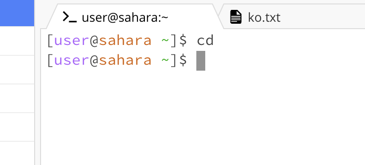

  
<h3 style="font:Arial Black;"> Lab Report 1 </h3>

 October 3, 2023

<h4 style="font:Tahoma;"> Terminal Commands </h4>

 For week 1's lab, we learned how to use Edstem, a workspace, which has a terminal that we can use to run commands. Three of these such commands are <i>cd</i>, <i>ls</i>, and <i>cat</i>.

<ul style="font:Tahoma;">
  <li><b>cd</b></li>
  
  <table>
  <tr>
    <td> 
</img>
</td>
    <td> 
</img>
</td>
    <td> 
</img
</td>
  </tr>
  <tr>
    <td> 
Pic 1 Explanation
</td>
    <td> 
Pic 2 Explanation
</td>
    <td> 
Pic 3 Explanation
</td>
  </tr>
</table>
  
  <li><b>ls</b></li>

<table>
  <tr>
    <td> 
</img>
</td>
    <td> 
</img>
</td>
    <td> 
</img>
</td>
  </tr>
  <tr>
    <td> 
Pic 1 Explanation
</td>
    <td> 
Pic 2 Explanation
</td>
    <td> 
Pic 3 Explanation
</td>
  </tr>
</table>

  <li><b>cat</b></li>

<table>
  <tr>
    <td> 
</img>
</td>
    <td> 
</img>
</td>
    <td> 
</img>
</td>
  </tr>
  <tr>
    <td> 
Pic 1 Explanation
</td>
    <td> 
Pic 2 Explanation
</td>
    <td> 
Pic 3 Explanation
</td>
  </tr>
</table>
  
</ul>

